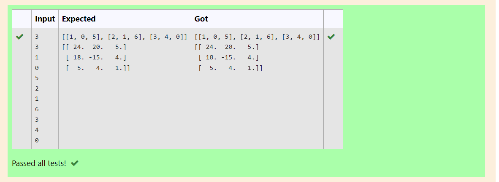

# Inverse-of-matrix

## AIM:To write a python program to find the inverse of nested array using numpy module.

## ALGORITHM:
### Step 1:
Import numpy module
### Step 2:
Declare a variables l1 and l2 as an empty list.
### Step 3:
Get the input of the variables n and m.
### Step 4:
Loop a variable i in the range of n and nest loop a variable j in range m
### Step 5:
Get the value of num variable 
### Step 6:
During the loop append the num values to l1 and l1 valuse to list l2
### Step7:
Declare a variable value1 to l2 by coverting to an array
### Step 8:
Declare a variable inverse, using numpy module's linalg and inv functions find the inverse of l2
### Step9:
Print the value of the inverse


## PROGRAM:
```
#Developed By:Manoj Guna Sundar Tella
#Ref No:21003796
import numpy as np
l1,l2 = [],[]
r,c= int(input()),int(input())
for i in range(r):
    for j in range(c):
        num=int(input ())
        l1.append (num)
    l2. append (l1)
    l1=[]
print (l2)
valuel=np.array(l2)
inverse = np.linalg.inv(valuel)
print (Inverse)
```

## OUTPUT:


## RESULT:
Therefore the program  is successfully executed to find the inverse of nested arrays using numpy module.
